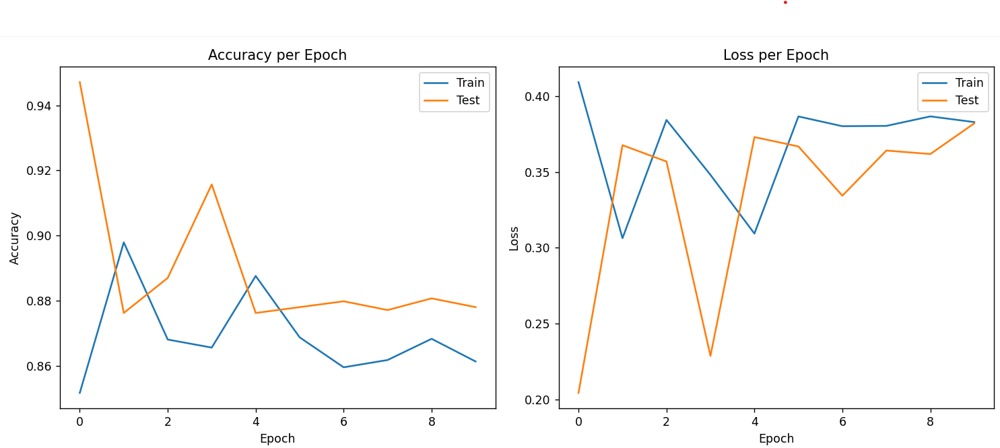
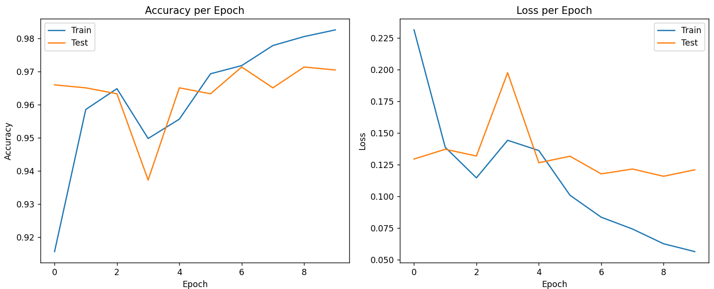
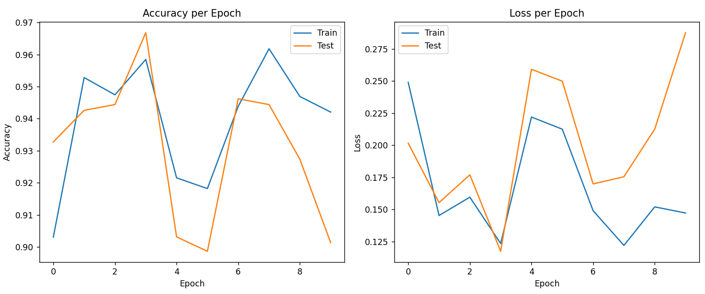
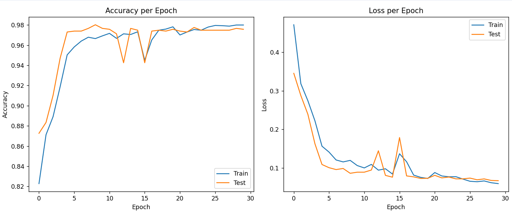

### SMS Spam Detection using RNN (with Optuna Hyperparameter Tuning)

## Overview

This project implements an RNN-based text classification system for detecting SMS spam messages.
It explores multiple recurrent neural network architectures — including padded, packed padded, and optimized RNNs — and uses Optuna for hyperparameter tuning to achieve the best model performance.

The project also integrates Makefile automation, Docker, and GitHub Actions CI/CD, making it easy to train, tune, and deploy the model on cloud platforms like AWS or GCP.

Features

 End-to-end deep learning pipeline for SMS spam detection
 Dynamic RNN architecture (Packed + Padded Sequences)
 Hyperparameter optimization using Optuna
 Learning rate scheduler (ReduceLROnPlateau)
 Automated training and evaluation with accuracy/loss tracking
 Makefile automation for all tasks
 Continuous Integration (GitHub Actions)
 Ready for containerization and deployment with Docker

### Model Architectures:

##  Basic RNN (with padded sequences)

Trained with fixed-length padding

Uses CrossEntropyLoss

Evaluates basic RNN capability on text data

 Training vs Validation Accuracy & loss 
 

## RNN with Packed Padded Sequences

Handles variable-length inputs efficiently

Better memory utilization

Faster convergence

 Training vs Validation Accuracy & Loss

 ## Optimized RNN with Learning Rate Scheduler

Adam optimizer

ReduceLROnPlateau scheduler

Dropout regularization

 Training vs Validation Accuracy & Loss

 ## Final Model (Optuna Best Hyperparameters)

 Optuna found the best configuration:
 {
  "emb_size": 102,
  "hidden_size": 200,
  "learning_rate": 2.75e-05,
  "dropout": 0.2801
}

Final Model Accuracy & loss 

Setup Instructions: 
1.Clone the repository
git clone https://github.com/<your-username>/SMS-Spam-Detection-RNN-Optuna.git
cd SMS-Spam-Detection-RNN-Optuna

2️. Create and activate a virtual environment
python -m venv venv312
venv312\Scripts\activate

3️. Install dependencies
pip install -r requirements.txt

4. Training and Tuning (via Makefile)
Run hyperparameter tuning
make tune

5. Retrain final model using best Optuna parameters
make train_final

6. Clean temporary files
make clean

Docker Usage

To build and run the project in Docker:

make docker-build
make docker-run

or manually:

docker build -t sms-spam-rnn .
docker run -it sms-spam-rnn

## Continuous Integration (GitHub Actions)

This project includes a .github/workflows/ci.yml pipeline that:

Runs linting (flake8)

Trains and tests the model

Uploads trained artifacts

Prepares for container registry deployment